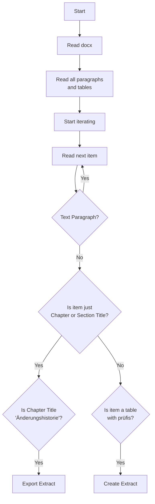

# KohlrAHBi

<p align="center">
  
</p>


Kohlrahbi generates machine-readable files from AHB documents.
Kohlrahbi's sister is [MIG_mose](https://github.com/Hochfrequenz/migmose).

If you're looking for a tool to process the **official** BDEW XMLs for AHBs (available since 2024), checkout [fundamend](https://github.com/Hochfrequenz/xml-fundamend-python).

## Rationale

German utilities exchange data using [EDIFACT](https://en.wikipedia.org/wiki/EDIFACT); This is called market communication (mako).
The _Forum Datenformate_ of the BDEW publishes the technical regulations of the EDIFACT based market communication on [`edi-energy.de`](https://www.edi-energy.de/).
These rules are not stable but change twice a year (in theory) or few times per year (in reality).

Specific rules, which are binding for every German utility are kind of formalised in so called "**A**nwendungs**h**and**b**üchern" (AHB).
Those AHBs are basically long tables that describe:
> As a utility, if I want to exchange data about business process XYZ with a market partner, then I have to provide the following information: [...]

In total the regulations from these Anwendungshandbücher span several thousand pages.
And by pages, we really _mean_ pages.
EDIFACT communication is basically the API between German utilities for most of their B2B processes.
However, the technical specifications of this API are

* prose
* on DIN A4 pages.

The Anwendungshandbücher are the epitome of digitization with some good intentions.

Although the AHBs are publicly available as PDF or Word files on `edi-energy.de`, they are hardly accessible in a technical sense:

* You cannot automatically extract information from the AHBs.
* You cannot run automatic comparisons between different versions.
* You cannot automatically test your own API against the set of rules, described in the AHBs (as prose).
* You cannot view or visualize the information from the AHBs in any more intuitive or practical way, than the raw tables from the AHB files.
* ...any many more...

The root cause for all these inaccessibility is a technical one:
Information that are theoretically structured are published in an unstructured format (PDF or Word), which is not suited for technical specifications in IT.

KohlrAHBi as a tool helps you to break those chains and access the AHBs as you'd expect it from technical specs: easy and automatically instead of with hours of mindless manual work.

**KohlrAHBi takes the `.docx` files published by `edi-energy.de` as an input and returns truly machine-readable data in a variety of formats (JSON, CSV...) as a result.**

Hence, KohlrAHBi is the key for unlocking any automation potential that is reliant on information hidden in the Anwendungshandbücher.

We're all hoping for the day of true digitization on which this repository will become obsolete.

## Installation

Kohlrahbi is a Python based tool.
Therefor you have to make sure, that Python is running on your machine.

We recommend to use virtual environments to keep your system clean.

Create a new virtual environment with

```bash
python -m venv .venv
```

The activation of the virtual environment depends on your used OS.

### Windows

```powershell
.venv\Scripts\activate
```

### MacOS/Linux

```zsh
source .venv/bin/activate
```

Finally, install the package with

```bash
pip install kohlrahbi
```

## Usage

Kohlrahbi is a command line tool.
You can use it in three different ways:

1. Extract AHB tables for all prüfidentifikatoren or a specific prüfidentifikator of a provided format version.
2. Extract all conditions for each format of a provided format version.
3. Extract the change history of a provided format version.

You can run the following command to get an overview of all available commands and options.

```bash
kohlrahbi --help
```

> [!NOTE]
> For the following steps we assume that you cloned our [edi_energy_mirror](https://github.com/Hochfrequenz/edi_energy_mirror/) to a neighbouring directory.
> The `edi_energy_mirror` contains the `.docx` files of the AHBs.
> The folder structure should look like this:
> ```plaintext
> .
> ├── edi_energy_mirror
> └── kohlrahbi
> ```

### Extract AHB table

To extract the all AHB tables for each pruefi of a specific format version, you can run the following command.

```bash
kohlrahbi ahb --edi-energy-mirror-path ../edi_energy_mirror/ --output-path ./output/ --file-type csv --format-version FV2310
```

To extract the AHB tables for a specific pruefi of a specific format version, you can run the following command.

```bash
kohlrahbi ahb -eemp ../edi_energy_mirror/ --output-path ./output/ --file-type csv --pruefis 13002 --format-version FV2310
```

You can also provide multiple pruefis.

```bash
kohlrahbi ahb -eemp ../edi_energy_mirror/ --output-path ./output/ --file-type csv --pruefis 13002 --pruefis 13003 --pruefis 13005 --format-version FV2310
```

And you can also provide multiple file types.

```bash
kohlrahbi ahb -eemp ../edi_energy_mirror/ --output-path ./output/ --file-type csv --file-type xlsx --file-type flatahb --pruefis 13002 --format-version FV2310
```

### Extract all conditions

To extract all conditions for each format of a specific format version, you can run the following command.

```bash
kohlrahbi conditions -eemp ../edi_energy_mirror/ --output-path ./output/ --format-version FV2310
```
This will provide you with:
* all conditions
* all packages

found in all AHBs (including the condition texts from package tables) within the specified folder with the .docx files.
The output will be saved for each Edifact format separately as `conditions.json` and `packages.json` in the specified output path.
Please note that the information regarding the conditions collected here may more comprehensive compared to the information collected for the AHBs above. This is because `conditions` uses a different routine than `ahb`.

### Extract change history

```bash
kohlrahbi changehistory -eemp ../edi_energy_mirror/ --output-path ./output/ --format-version FV2310
```

## `.docx` Data Sources

kohlrahbi internally relies on a [specific naming schema](https://github.com/Hochfrequenz/kohlrahbi/blob/22a78dc076c7d5f9248cb9e8707b0cc14a2981d3/src/kohlrahbi/read_functions.py#L57) of the `.docx` files in which the file name holds information about the edifact format and validity period of the AHBs contained within the file.
The easiest way to be compliant with this naming schema is to clone our [edi_energy_mirror](https://github.com/Hochfrequenz/edi_energy_mirror/) repository to your localhost.

## Results

There is a kohlrahbi based CI pipeline from the edi_energy_mirror mentioned above to the repository [machine-readable_anwendungshandbuecher](https://github.com/Hochfrequenz/machine-readable_anwendungshandbuecher) where you can find scraped AHBs as JSON, CSV or Excel files.

## Workflow



## AHB page number per Format

The following table shows the page number of the AHBs for each format of the format version FV2310.

| Format       | Page number | Hint                                                |     |
| ------------ | ----------- | --------------------------------------------------- | --- |
| UTILMD Strom | 1064        |                                                     |     |
| UTILMD Gas   | 345         |                                                     |     |
| REQOTE       | 264         | together with QUOTES, ORDERS, ORDRSP, ORDCHG        |     |
| QUOTES       | 264         | together with REQOTE, ORDERS, ORDRSP, ORDCHG        |     |
| ORDRSP       | 264         | together with REQOTE, QUOTES, ORDERS, ORDCHG        |     |
| ORDERS       | 264         | together with REQOTE, QUOTES, ORDRSP, ORDCHG        |     |
| ORDCHG       | 264         | together with REQOTE, QUOTES, ORDERS, ORDRSP        |     |
| MSCONS       | 164         |                                                     |     |
| UTILMD MaBis | 133         |                                                     |     |
| REMADV       | 91          | together with INVOIC                                |     |
| INVOIC       | 91          | together with REMADV                                |     |
| IFTSTA       | 82          |                                                     |     |
| CONTRL       | 72          | together with APERAK, contains no Prüfis            |     |
| APERAK       | 72          | together with CONTRL, contains no Prüfis            |     |
| PARTIN       | 69          |                                                     |     |
| UTILTS       | 34          |                                                     |     |
| ORDRSP       | 30          | together with ORDERS                                |     |
| ORDERS       | 30          | together with ORDRSP                                |     |
| PRICAT       | 25          |                                                     |     |
| COMDIS       | 10          | good test for tables which are above change history |     |

## Development

### Setup

To set up the development environment, you have to install the dev dependencies.

```bash
tox -e dev
```

### Run all tests and linters

To run the tests, you can use tox.

```bash
tox
```

See our [Python Template Repository](https://github.com/Hochfrequenz/python_template_repository#how-to-use-this-repository-on-your-machine) for detailed explanations.

## Contribute

You are very welcome to contribute to this template repository by opening a pull request against the main branch.

## Related Tools and Context

This repository is part of the [Hochfrequenz Libraries and Tools for a truly digitized market communication](https://github.com/Hochfrequenz/digital_market_communication/).
