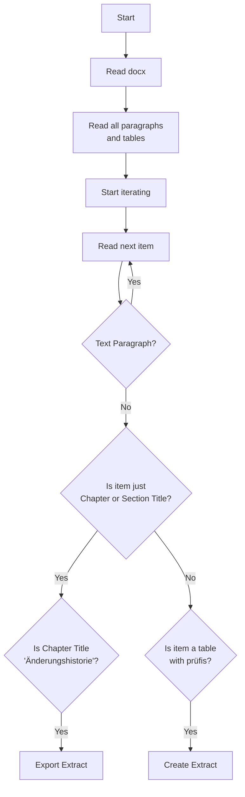

# KohlrAHBi


This tool helps to generate machine-readable files from AHB documents.


## Installation
Kohlrahbi is a Python based tool.
Therefor you have to make sure, that Python is running on your machine.

We recommend to use virtual environments to keep your system clean.

Create a new virtual environment with
```bash
python -m venv .venv
```

The activation of the virtual environment depends on your used OS.

**Windows**
```
.venv\Scripts\activate
```
**MacOS/Linux**
```
source .venv/bin/activate
```
Finally, install the package with

```bash
pip install kohlrahbi
```

## Usage

There are two ways to use kohlrahbi.
You can extract all prüfidetifikatoren listed in [all_known_pruefis.toml](src/kohlrahbi/all_known_pruefis.toml) or you can extract a specific prüfidetifikator.
### Get all Prüfidetifikatoren
If you want to extract all prüfidetifikatoren, you can run the following command.

```bash
kohlrahbi --input_path ../edi_energy_mirror/ --output_path ./output/
```

This will extract all prüfidetifikatoren listed in [all_known_pruefis.toml](src/kohlrahbi/all_known_pruefis.toml) and save them in the provided output path.


### Get a specific Prüfidetifikator

If you want to extract a specific prüfidetifikator, you can run the following command.

```bash
kohlrahbi --input_path ../edi_energy_mirror/ --output_path ./output/ --pruefi 11039
```

You can also provide multiple prüfidetifikatoren.

```bash
kohlrahbi --input_path ../edi_energy_mirror/ --output_path ./output/ --pruefi 11039 --pruefi 11040 --pruefi 11041
```

## Workflow




## Development

### Setup

To setup the development environment, you have to install the dev dependencies.

```bash
tox -e dev
```

### Run all tests and linters

To run the tests, you can use tox.

```bash
tox
```
