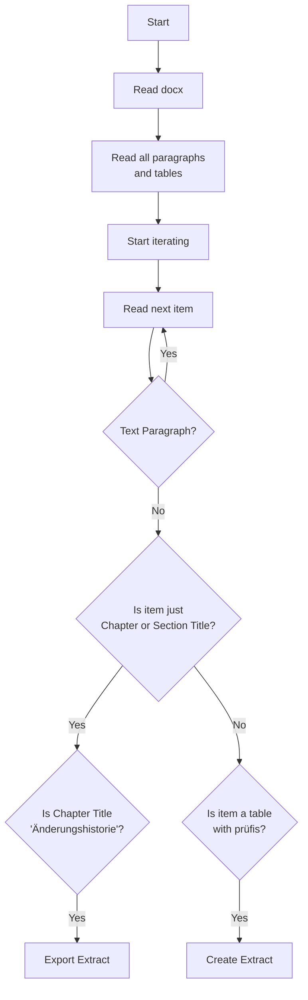

# KohlrAHBi


Kohlrahbi generates machine-readable files from AHB documents.

## Rationale
German utilities exchange data using [EDIFACT](https://en.wikipedia.org/wiki/EDIFACT); This is called market communication (mako).
The _Forum Datenformate_ of the BDEW publishes the technical regulations of the EDIFACT based market communication on [`edi-energy.de`](https://www.edi-energy.de/).
These rules are not stable but change twice a year (in theory) or few times per year (in reality).

Specific rules, which are binding for every German utility are kind of formalised in so called "**A**nwendungs**h**and**b**üchern" (AHB).
Those AHBs are basically long tables that describe:
> As a utility, if I want to exchange data about business process XYZ with a market partner, then I have to provide the following information: [...]

In total the regulations from these Anwendungshandbücher span several thousand pages.
And by pages, we really _mean_ pages.
EDIFACT communication is basically the API between German utilities for most of their B2B processes.
However, the technical specifications of this API are
* prose
* on DIN A4 pages.

The Anwendungshandbücher are the epitome of digitization with some good intentions.

Although the AHBs are publicly available as PDF or Word files on `edi-energy.de`, they are hardly accessible in a technical sense:
* You cannot automatically extract information from the AHBs.
* You cannot run automatic comparisons between different versions.
* You cannot automatically test your own API against the set of rules, described in the AHBs (as prose).
* You cannot view or visualize the information from the AHBs in any more intuitive or practical way, than the raw tables from the AHB files.
* ...any many more...

The root cause for all these inaccessibility is a technical one:
Information that are theoretically structured are published in an unstructured format (PDF or Word), which is not suited for technical specifications in IT.

KohlrAHBi as a tool helps you to break those chains and access the AHBs as you'd expect it from technical specs: easy and automatically instead of with hours of mindless manual work.

**KohlrAHBi takes the `.docx` files published by `edi-energy.de` as an input and returns truly machine-readable data in a variety of formats (JSON, CSV...) as a result.**

Hence, KohlrAHBi is the key for unlocking any automation potential that is reliant on information hidden in the Anwendungshandbücher.

We're all hoping for the day of true digitization on which this repository will become obsolete.

## Installation
Kohlrahbi is a Python based tool.
Therefor you have to make sure, that Python is running on your machine.

We recommend to use virtual environments to keep your system clean.

Create a new virtual environment with
```bash
python -m venv .venv
```

The activation of the virtual environment depends on your used OS.

**Windows**
```
.venv\Scripts\activate
```
**MacOS/Linux**
```
source .venv/bin/activate
```
Finally, install the package with

```bash
pip install kohlrahbi
```

## Usage

There are two ways to use kohlrahbi.
1. You can extract all prüfidentifikatoren listed in [all_known_pruefis.toml,](src/kohlrahbi/all_known_pruefis.toml)
2. or you can extract a specific prüfidentifikator.

### Get all Prüfidentifikatoren
If you want to extract all prüfidentifikatoren, you can run the following command.
For the following steps we assume that you cloned our [edi_energy_mirror](https://github.com/Hochfrequenz/edi_energy_mirror/) to a neighbouring directory.

```bash
kohlrahbi --input_path ../edi_energy_mirror/edi_energy_de/current --output_path ./output/ --file-type flatahb
```

This will extract all prüfidentifikatoren listed in [all_known_pruefis.toml](src/kohlrahbi/all_known_pruefis.toml) and save them in the provided output path.

### `.docx` Data Sources
kohlrahbi internally relies on a [specific naming schema](https://github.com/Hochfrequenz/kohlrahbi/blob/22a78dc076c7d5f9248cb9e8707b0cc14a2981d3/src/kohlrahbi/read_functions.py#L57) of the `.docx` files in which the file name holds information about the edifact format and validity period of the AHBs contained within the file.
The easiest way to be compliant with this naming schema is to clone our [edi_energy_mirror](https://github.com/Hochfrequenz/edi_energy_mirror/) repository to your localhost.

### Get a specific Prüfidentifikator

If you want to extract a specific prüfidentifikator, you can run the following command.

```bash
kohlrahbi --input_path ../edi_energy_mirror/edi_energy_de/current --output_path ./output/ --pruefis 11039 --file-type xslx
```

You can also provide multiple prüfidentifikatoren.

```bash
kohlrahbi --input_path ../edi_energy_mirror/edi_energy_de/current --output_path ./output/ --pruefis 11039 --pruefis 11040 --pruefi 11041 --file-type csv
```
### Results
There is a kohlrahbi based CI pipeline from the edi_energy_mirror mentioned above to the repository [machine-readable_anwendungshandbuecher](https://github.com/Hochfrequenz/machine-readable_anwendungshandbuecher) where you can find scraped AHBs as JSON, CSV or Excel files.

### Export ConditionKeys and ConditionTexts
For example to export condition.json files to [edi_energy_ahb_conditions_and_packages](https://github.com/Hochfrequenz/edi_energy_ahb_conditions_and_packages). Works best if no flags for "Prüfindentifikatoren" (--pruefis). In this case all known "Prüfidentifikatoren" are scanned. Thus all related conditions are gathered.
```bash
kohlrahbi --file-type conditions --input_path "Path\to\edi_energy_mirror\edi_energy_de\current" --output_path "Path\to\edi_energy_ahb_conditions_and_packages\aktuelleFV"
```

## Workflow




## Development

### Setup

To set up the development environment, you have to install the dev dependencies.

```bash
tox -e dev
```

### Run all tests and linters

To run the tests, you can use tox.

```bash
tox
```
See our [Python Template Repository](https://github.com/Hochfrequenz/python_template_repository#how-to-use-this-repository-on-your-machine) for detailed explanations.

## Contribute

You are very welcome to contribute to this template repository by opening a pull request against the main branch.

## Related Tools and Context

This repository is part of the [Hochfrequenz Libraries and Tools for a truly digitized market communication](https://github.com/Hochfrequenz/digital_market_communication/).
